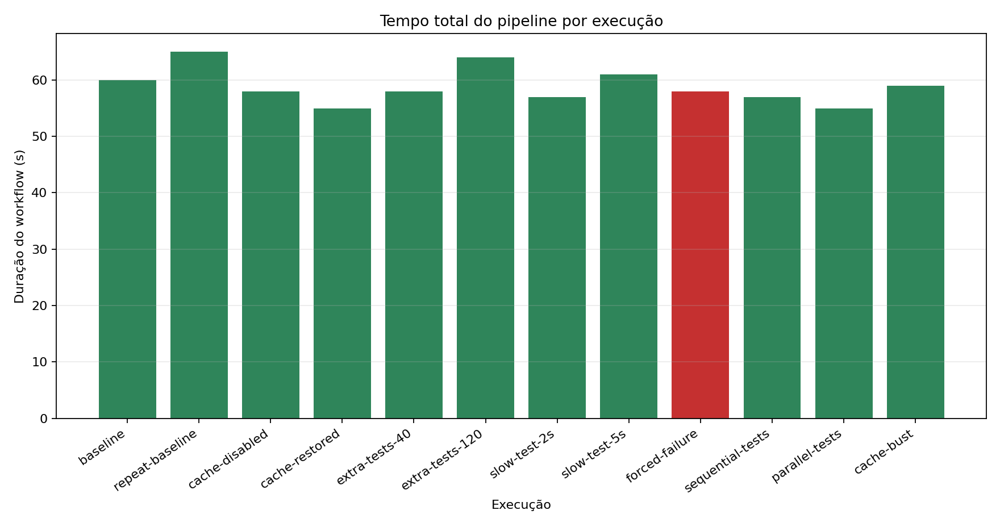
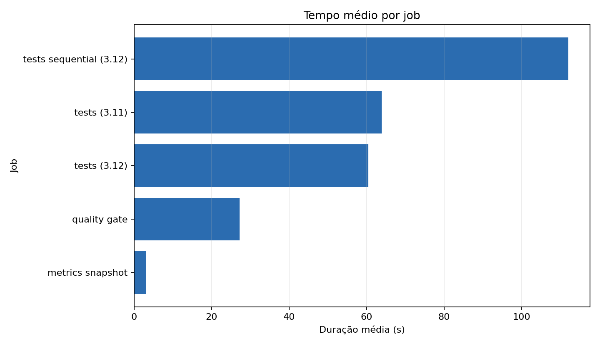
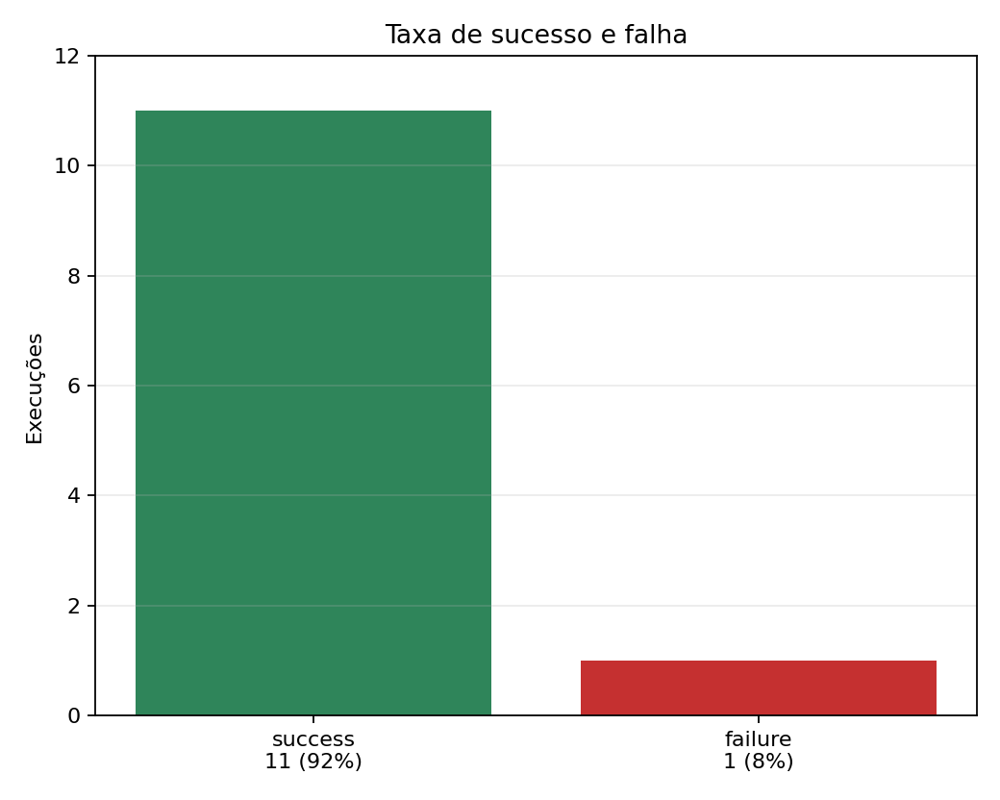
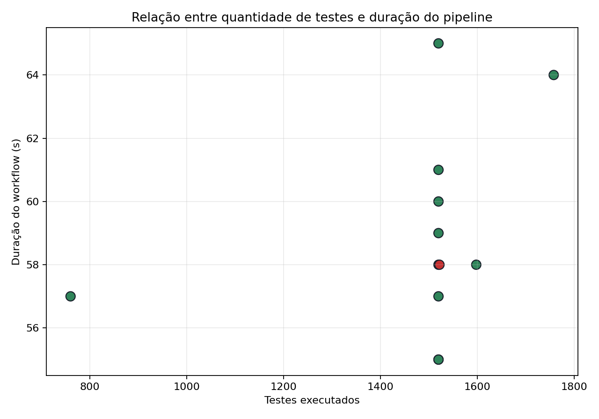
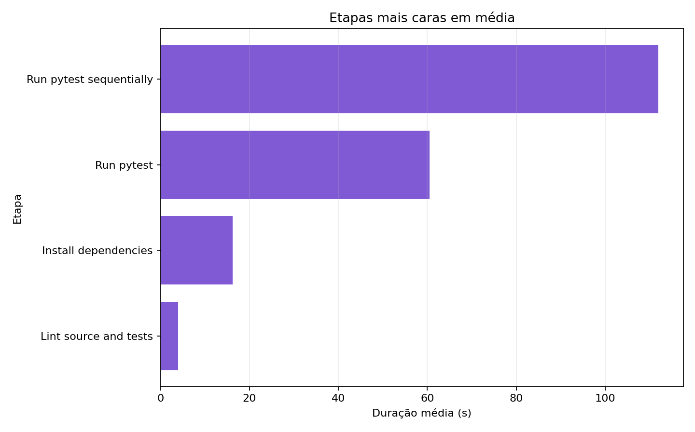

# Relatório técnico do experimento CI/CD

<a id="escopo-e-origem"></a>
## Escopo e origem

Este repositório adapta o projeto real [python-humanize/humanize](https://github.com/python-humanize/humanize), clonado no commit `d333afdc5e05941c67c552c9f153eec4d48e64b4`. A escolha foi deliberada: a biblioteca já tinha testes de número, tamanho, listas, datas e internacionalização, então o pipeline mede uma suíte real de Python em vez de um projeto montado só para a atividade.

Repositório do experimento: [thiagomes07/metrics_collector](https://github.com/thiagomes07/metrics_collector)

Workflow analisado: [`.github/workflows/pipeline-metrics.yml`](https://github.com/thiagomes07/metrics_collector/blob/main/.github/workflows/pipeline-metrics.yml)

As 12 execuções foram feitas em `workflow_dispatch` no dia 3 de junho de 2026, sobre o commit real `69313d54ab2201cfb8a90284fd54c4f3605d4408`. Depois dos runs, corrigi o coletor para lidar melhor com redirects de artifacts e jobs skipped; essa correção não altera os runs medidos, só a extração dos dados.

<a id="estrutura"></a>
## Estrutura de diretórios

```text
.github/workflows/pipeline-metrics.yml
scripts/ci_variation_tests.py
scripts/summarize_junit.py
scripts/collect_metrics.py
scripts/generate_charts.py
requirements-experiment.txt
data/pipeline_metrics.csv
data/step_metrics.csv
data/sample_pipeline_metrics.csv
data/sample_step_metrics.csv
charts/
reports/pipeline-analysis.md
```

<a id="pipeline"></a>
## Pipeline

O workflow `CI Metrics Experiment` cobre instalação de dependências, cache de `pip`, lint com `ruff`, testes com `pytest`, artifacts de resultado e um job final de snapshot. Ele usa `workflow_dispatch`, `matrix`, `needs`, `actions/cache` e `actions/upload-artifact`.

Jobs:

- `quality gate`: instala dependências, roda `ruff check src tests` e publica `quality-summary.json`.
- `tests (3.11)` e `tests (3.12)`: rodam em matrix, geram variações controladas e publicam JUnit, log do pytest e `summary.json`.
- `tests sequential (3.12)`: usado quando `execution_mode=sequential`.
- `metrics snapshot`: consolida contexto do run e status dos jobs via `needs`.

<a id="variacoes"></a>
## Variações executadas

| Execução | `experiment_variant` | Parâmetros principais | Justificativa |
|---:|---|---|---|
| 1 | `baseline` | cache on, parallel, 0 extras | Medir referência limpa. |
| 2 | `repeat-baseline` | cache on, parallel, 0 extras | Medir ruído de runner sem mudar código. |
| 3 | `cache-disabled` | cache off | Testar custo de instalação sem cache. |
| 4 | `cache-restored` | cache on | Confirmar comportamento com cache restaurado. |
| 5 | `extra-tests-40` | 40 testes gerados | Aumentar a suíte sem alterar a biblioteca. |
| 6 | `extra-tests-120` | 120 testes gerados | Forçar crescimento maior de carga de teste. |
| 7 | `slow-test-2s` | `slow_test_seconds=2` | Simular I/O lento isolado. |
| 8 | `slow-test-5s` | `slow_test_seconds=5` | Ver se um teste lento desloca o caminho crítico. |
| 9 | `forced-failure` | `fail_mode=generated-assertion` | Registrar falha controlada e artifacts de pipeline vermelho. |
| 10 | `sequential-tests` | `execution_mode=sequential` | Comparar job único contra matrix paralela. |
| 11 | `parallel-tests` | `execution_mode=parallel` | Repetir paralelismo logo após o sequential. |
| 12 | `cache-bust` | `cache_mode=bust` | Medir chave nova de cache sem desligar a etapa. |

<a id="coleta"></a>
## Coleta de métricas

O coletor usa a API REST do GitHub com autenticação por token. Ele pagina workflow runs e jobs, trata rate limit, baixa artifacts, lê JUnit/JSON e grava duas bases:

- `data/pipeline_metrics.csv`: linha por job, com `run_id`, commit, status, duração do workflow, duração do job, contagem de testes e campos extras.
- `data/step_metrics.csv`: linha por etapa do job, com duração de steps relevantes.

Comando usado:

```bash
GITHUB_TOKEN="$(gh auth token)" python scripts/collect_metrics.py \
  --repo thiagomes07/metrics_collector \
  --workflow pipeline-metrics.yml \
  --limit 12 \
  --out data/pipeline_metrics.csv \
  --steps-out data/step_metrics.csv \
  --artifacts-dir data/downloaded-artifacts
```

Campos extras coletados: `run_attempt`, `event`, `branch`, `variant`, `python_version`, `lead_time_seconds`, `artifact_count` e `html_url`. Eu incluí esses campos porque matrix, reruns e dispatch manual tornam uma linha por job ambígua se ela tiver só SHA e status.

<a id="graficos"></a>
## Gráficos

Os gráficos abaixo foram gerados a partir de `data/pipeline_metrics.csv` e `data/step_metrics.csv`, não dos CSVs sintéticos.











<a id="base-coletada"></a>
## Base coletada

| run_id | variant | status | duration_s | tests | failures | lead_s | commit |
| --- | --- | --- | --- | --- | --- | --- | --- |
| [26891995918](https://github.com/thiagomes07/metrics_collector/actions/runs/26891995918) | baseline | success | 60 | 1520 | 0 | 72 | 69313d54ab22 |
| [26892075323](https://github.com/thiagomes07/metrics_collector/actions/runs/26892075323) | repeat-baseline | success | 65 | 1520 | 0 | 156 | 69313d54ab22 |
| [26892077297](https://github.com/thiagomes07/metrics_collector/actions/runs/26892077297) | cache-disabled | success | 58 | 1520 | 0 | 151 | 69313d54ab22 |
| [26892079652](https://github.com/thiagomes07/metrics_collector/actions/runs/26892079652) | cache-restored | success | 55 | 1520 | 0 | 151 | 69313d54ab22 |
| [26892082085](https://github.com/thiagomes07/metrics_collector/actions/runs/26892082085) | extra-tests-40 | success | 58 | 1598 | 0 | 156 | 69313d54ab22 |
| [26892084217](https://github.com/thiagomes07/metrics_collector/actions/runs/26892084217) | extra-tests-120 | success | 64 | 1758 | 0 | 164 | 69313d54ab22 |
| [26892086661](https://github.com/thiagomes07/metrics_collector/actions/runs/26892086661) | slow-test-2s | success | 57 | 1520 | 0 | 159 | 69313d54ab22 |
| [26892088940](https://github.com/thiagomes07/metrics_collector/actions/runs/26892088940) | slow-test-5s | success | 61 | 1520 | 0 | 166 | 69313d54ab22 |
| [26892091428](https://github.com/thiagomes07/metrics_collector/actions/runs/26892091428) | forced-failure | failure | 58 | 1522 | 2 | 165 | 69313d54ab22 |
| [26892093997](https://github.com/thiagomes07/metrics_collector/actions/runs/26892093997) | sequential-tests | success | 57 | 760 | 0 | 166 | 69313d54ab22 |
| [26892096157](https://github.com/thiagomes07/metrics_collector/actions/runs/26892096157) | parallel-tests | success | 55 | 1520 | 0 | 167 | 69313d54ab22 |
| [26892098818](https://github.com/thiagomes07/metrics_collector/actions/runs/26892098818) | cache-bust | success | 59 | 1520 | 0 | 173 | 69313d54ab22 |

Resumo: 12 execuções, 11 sucessos, 1 falha controlada, menor duração de 55 s (`cache-restored` e `parallel-tests`) e maior duração de 65 s (`repeat-baseline`). O baseline médio, usando `baseline` e `repeat-baseline`, ficou em 62,5 s.

<a id="perguntas-de-analise"></a>
## Perguntas de análise

**Qual etapa mais contribuiu para o tempo total do pipeline?**  
O step mais caro em média foi `Install dependencies`, com 7,34 s em `data/step_metrics.csv`. `Run pytest` ficou em 3,00 s de média e `Run pytest sequentially` em 2,00 s. No nível de job, `tests (3.12)` teve média de 18,09 s, `tests (3.11)` teve 17,55 s e `quality gate` teve 16,58 s. Minha expectativa era que pytest dominasse, mas neste projeto a instalação e o overhead de job pesaram mais que a suíte.

**Houve diferença significativa entre execuções com e sem cache?**  
Não. `cache-disabled` levou 58 s, enquanto `cache-restored` levou 55 s e `cache-bust` levou 59 s. A diferença ficou dentro do ruído observado entre `baseline` e `repeat-baseline`, que variaram de 60 s para 65 s sem mudança de configuração. Para este projeto pequeno, cache de `pip` não foi o gargalo principal.

**O paralelismo reduziu o tempo total? Em que condições?**  
Quase nada neste recorte. `parallel-tests` levou 55 s e `sequential-tests` levou 57 s, diferença de 2 s. Além disso, a comparação não é perfeitamente justa: o job sequencial executou uma versão de Python e somou 760 testes, enquanto a matrix paralela executou 3.11 e 3.12 e somou 1520 testes. O dado útil aqui é menos "paralelismo ganhou" e mais "o custo fixo do runner escondeu o custo real dos testes".

**Quais falhas foram mais frequentes?**  
Houve uma falha planejada: `forced-failure`, run `26892091428`. Ela gerou 2 falhas porque a mesma asserção quebrada rodou nas duas versões da matrix. Não apareceu falha de lint, instalação, artifact ou cache.

**O pipeline fornece feedback rápido o suficiente para o desenvolvedor?**  
Sim para este projeto. O pior run medido levou 65 s e a maioria ficou entre 55 s e 61 s. Para uma biblioteca pequena, eu consideraria esse feedback bom. O ponto fraco é que o tempo total tem parcela grande de setup, então duplicar a suíte não necessariamente dobra a duração, mas também limita o benefício de otimizar apenas testes.

**Que melhorias poderiam ser feitas no pipeline?**  
Eu separaria testes rápidos e lentos por marcador, publicaria o resumo no `$GITHUB_STEP_SUMMARY`, corrigiria o modo sequencial para executar 3.11 e 3.12 no mesmo job quando a comparação for o foco, e passaria a registrar cache hit diretamente no CSV. Também fixaria versões principais de ações que já emitiram aviso de Node 20 durante os runs.

**Quais limitações existem nos dados coletados?**  
Todas as execuções foram `workflow_dispatch` no mesmo commit, então `lead_time_seconds` mede distância entre commit e fim do run manual, não lead time real de desenvolvimento. A contagem de testes soma a matrix; por isso 1520 testes significam a suíte rodada em duas versões, não 1520 casos únicos. O modo `sequential-tests` executou só Python 3.12, o que limita a comparação contra `parallel-tests`. Artifacts também expiram, então a coleta precisa acontecer perto dos runs.

**Como essa análise poderia apoiar decisões de engenharia?**  
Ela mostra que, para este projeto, o caminho mais prático não é começar otimizando testes individuais. O ganho provável está em reduzir setup, ajustar escopo da matrix por tipo de mudança e melhorar observabilidade do próprio pipeline. Também evita uma decisão automática de "cache resolve": nesse experimento, cache não moveu o ponteiro de forma convincente.

<a id="resultados-inesperados"></a>
## Resultados inesperados

O primeiro resultado inesperado foi `cache-disabled` não piorar o pipeline. Ele levou 58 s, abaixo do baseline repetido de 65 s e só 3 s acima de `cache-restored`. Isso contraria a hipótese de que dependências dominariam. A explicação provável é que o ambiente hospedado já entrega rede e disco rápidos o suficiente para este conjunto pequeno de dependências, enquanto fila, inicialização de job e variação de runner adicionam ruído parecido.

O segundo resultado inesperado foi o pouco impacto dos testes lentos artificiais. `slow-test-2s` fechou em 57 s e `slow-test-5s` em 61 s. Eu esperava diferença mais visível por causa da matrix, mas o atraso foi absorvido pelo caminho crítico de setup e pela execução paralela dos jobs. O teste lento apareceu mais claramente no tempo de pytest do que no tempo total do workflow.

O terceiro ponto, menos elegante mas importante, foi a comparação sequential versus parallel. Eu esperava uma vitória clara do paralelismo. O resultado bruto foi 57 s contra 55 s, mas o sequential rodou metade da matriz. A conclusão honesta é que o desenho dessa variação mede overhead e não uma equivalência perfeita de carga.

<a id="hipotese-vs-resultado"></a>
## Hipótese inicial vs resultado observado

Hipótese inicial: cache reduziria claramente a duração, paralelismo reduziria bastante o tempo total e aumento de testes teria efeito quase linear.

Resultado observado: nenhuma das três hipóteses apareceu limpa. Cache ficou dentro do ruído. Paralelismo teve diferença pequena e comparação limitada. O aumento de testes foi visível só no extremo: `extra-tests-40` ficou em 58 s, mas `extra-tests-120` foi para 64 s e se aproximou do pior run. A parte positiva é que o pipeline ficou rápido mesmo com variações, mas o experimento mostrou que otimizar CI/CD exige separar custo fixo de custo de teste antes de mexer na configuração.

<a id="evidencias-reais"></a>
## Evidências reais

- Repositório: [thiagomes07/metrics_collector](https://github.com/thiagomes07/metrics_collector)
- Workflow YAML: [pipeline-metrics.yml](https://github.com/thiagomes07/metrics_collector/blob/main/.github/workflows/pipeline-metrics.yml)
- Commit usado nos 12 runs: [`69313d54ab2201cfb8a90284fd54c4f3605d4408`](https://github.com/thiagomes07/metrics_collector/commit/69313d54ab2201cfb8a90284fd54c4f3605d4408)
- Runs reais: `26891995918`, `26892075323`, `26892077297`, `26892079652`, `26892082085`, `26892084217`, `26892086661`, `26892088940`, `26892091428`, `26892093997`, `26892096157`, `26892098818`.
- CSV real: `data/pipeline_metrics.csv`
- Steps reais: `data/step_metrics.csv`
- Gráficos reais: `charts/*.png`

Links individuais dos runs estão na tabela da seção `Base coletada`.

<a id="reproducao"></a>
## Reprodução

1. Clone o repositório `thiagomes07/metrics_collector`.
2. Instale dependências do projeto: `python -m pip install -e ".[tests]"`.
3. Instale dependências de análise: `python -m pip install -r requirements-experiment.txt`.
4. Dispare as 12 variações por `workflow_dispatch` usando os parâmetros da seção `Variações executadas`.
5. Colete os dados com `scripts/collect_metrics.py`.
6. Gere os gráficos com `scripts/generate_charts.py`.
7. Confira `reports/pipeline-analysis.md` junto dos CSVs e links reais de Actions.
